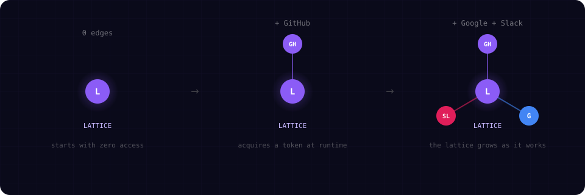
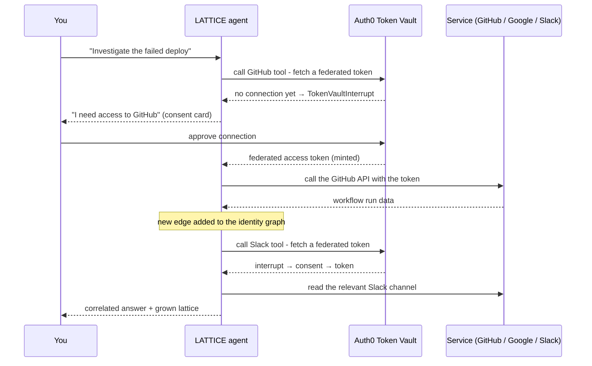

# LATTICE

### Agent Identity Graph Protocol

An autonomous AI agent that starts with **zero connections** and acquires authenticated access to external services **at runtime**, building its identity graph as it works.

<p align="center">
  
</p>

---

## The idea

Every other AI agent is handed its keys up front. You decide at configuration time which services it can touch, wire in the API keys, and ship it with a fixed set of powers.

LATTICE inverts that. The agent boots with an **empty identity graph**. You give it a goal. As it reasons about the goal it discovers which services it needs, and it asks for each one **the moment it needs it** through [Auth0 Token Vault](https://auth0.com/docs/secure/tokens/token-vault). You approve the connection, a federated token is minted into the vault, and a new edge appears on the lattice. The agent's identity is not provisioned. It is *grown*.

Give it _"Why did our deployment fail?"_ and watch it:

1. Reach for **GitHub** to read the CI run, hit a missing connection, and ask you to approve it
2. Use the freshly minted token to pull the failing workflow
3. Reach for **Slack** to correlate with the team's discussion, and acquire that edge too
4. Cross-reference and report back

Each step adds an authenticated edge. The graph on the right of the screen is drawn from the agent's **actual** token lifecycle, not a script.

## How it actually works

The novel part is the runtime acquisition loop. There is no pre-flight "connect your accounts" screen. The agent tries a tool, and a missing token *is* the trigger for consent.



Concretely:

- Each tool is wrapped with a Token Vault authorizer (`withTokenVault`). On execution it exchanges the user's refresh token for a **federated connection access token** scoped to that service.
- If no connection exists (or scopes are missing), the authorizer raises a `TokenVaultInterrupt` instead of failing. The server streams it to the client via the AI SDK's interrupt channel.
- The client (`useInterruptions`) turns that interrupt into a **consent card**. Approving it opens the Auth0 connection flow; on return the interrupted tool call resumes with the token now in hand.
- The identity graph and token-lifecycle panel are derived entirely from real message and interrupt state. A service node goes `idle → acquiring → connecting (awaiting consent) → active` based on the agent's actual tool calls.

## Supported services

| Service | Tools |
|---------|-------|
| **GitHub** | repos, issues, pull requests, Actions workflow runs, create issue |
| **Google** | Calendar events, Gmail search, Drive files |
| **Slack** | list channels, read history, post message |

Adding a service is two steps: register a `withTokenVault` authorizer for the connection, and write the tools that use `getAccessTokenFromTokenVault()`.

## Tech stack

- **Next.js 16** (App Router, Turbopack)
- **Auth0 Token Vault** via `@auth0/ai` and `@auth0/ai-vercel` for federated token exchange and interrupts
- **Vercel AI SDK** (`ai` + `@ai-sdk/react`) for streaming tool-calling
- **OpenAI gpt-4o** for agent reasoning
- **Canvas + Framer Motion** for the live identity graph

## Run it

### Prerequisites

- Node.js 20+
- An Auth0 tenant with **Token Vault** enabled
- An OpenAI API key
- Social connections configured in Auth0: GitHub, Google, Slack

### 1. Configure

```bash
cp .env.example .env.local
```

Fill in the values. `AUTH0_SECRET` is any 32-byte hex string (`openssl rand -hex 32`).

### 2. Auth0 setup

1. Create a **Regular Web Application** and enable **Token Vault** on the tenant.
2. Enable the social connections you want the agent to reach, with the scopes the tools request:
   - **GitHub** - `repo`, `read:user`, `read:org`
   - **Google** - Calendar, Gmail, Drive read-only scopes
   - **Slack** - `channels:read`, `channels:history`, `users:read`, `chat:write`
3. Set the callback and logout URLs:
   - Allowed Callback URLs: `http://localhost:3000/auth/callback`
   - Allowed Logout URLs: `http://localhost:3000`

### 3. Start

```bash
npm install
npm run dev
```

Open `http://localhost:3000`, click **Launch Agent**, and give it a goal. The first time it reaches for a service you will see the consent card; approve it and watch the edge light up.

## Demo

> Recording of a live run (zero edges to a full lattice across GitHub, Google, and Slack) goes here. Capture it against your own tenant: start a mission like _"Investigate my deployment status and check Slack for related discussion,"_ approve each connection as it is requested, and screen-record the graph filling in.

## Architecture

```
Browser
  Chat (React + AI SDK)   Identity Graph (Canvas + Motion)
        │                          ▲
        │  prompt / interrupts     │ real tool + interrupt state
        ▼                          │
Next.js server
  /api/chat  ──>  streamText + tools (withInterruptions)
        │
  Token Vault authorizers:  GitHub   Google   Slack
        │                     │        │        │
        └── federated token exchange ──┴────────┘
                              ▼        ▼        ▼
                          GitHub    Google    Slack
                            API      APIs      API
```

## License

MIT
